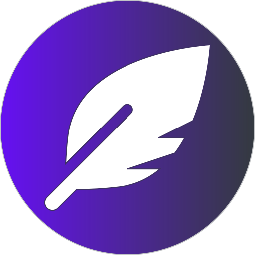

<!--
*** Thanks for checking out this README Template. If you have a suggestion that would
*** make this better, please fork the repo and create a pull request or simply open
*** an issue with the tag "enhancement".
*** Thanks again! Now go create something AMAZING! :D
***
***
***
*** To avoid retyping too much info. Do a search and replace for the following:
*** github_username, repo, twitter_handle, email
-->


<!-- PROJECT SHIELDS -->
<!--
*** I'm using markdown "reference style" links for readability.
*** Reference links are enclosed in brackets [ ] instead of parentheses ( ).
*** See the bottom of this document for the declaration of the reference variables
*** for contributors-url, forks-url, etc. This is an optional, concise syntax you may use.
*** https://www.markdownguide.org/basic-syntax/#reference-style-links
-->
[![Contributors][contributors-shield]][contributors-url]
[![Forks][forks-shield]][forks-url]
[![Stargazers][stars-shield]][stars-url]
[![Issues][issues-shield]][issues-url]
[![MIT License][license-shield]][license-url]


<!-- PROJECT LOGO -->
<p align="center">
  <a href="https://github.com/jestrella04/Writerhood">
    
  </a>

  <h3 align="center">Writerhood</h3>

  <p align="center">
    A virtual community for amateur writers.<br><br>
    ·
    <a href="https://github.com/jestrella04/Writerhood/issues">Report Bug</a>
    ·
    <a href="https://github.com/jestrella04/Writerhood/issues">Request Feature</a>
  </p>
</p>


<!-- TABLE OF CONTENTS -->
## Table of Contents

* [About the Project](#about-the-project)
  * [Built With](#built-with)
* [Getting Started](#getting-started)
  * [Prerequisites](#prerequisites)
  * [Installation](#installation)
* [Usage](#usage)
* [Roadmap](#roadmap)
* [Contributing](#contributing)
* [License](#license)
* [Contact](#contact)
* [Acknowledgements](#acknowledgements)


<!-- ABOUT THE PROJECT -->
## About The Project

A virtual community for amateur writers. This project is the source code that powers the website https://poetainos.com


### Built With

* [Laravel](https://laravel.com/)
* [Bootstrap](https://getbootstrap.com/)


<!-- GETTING STARTED -->
## Getting Started

To get a local copy up and running follow these simple steps.

### Prerequisites

To keep things clear and straight to the point, this instructions assumes you are familiar with Git, Composer, Yarn and Webpack and that you have already installed them on your machine.

### Installation
 
1. Clone the repo

```sh
git clone https://github.com/jestrella04/Writerhood.git
```

2. Install PHP dependencies
```sh
composer install
```

3. Install NPM modules
```sh
yarn install
```

4. Compile assets
```sh
yarn run dev
```
### Serve the project

There are several ways that you can serve the project so that you can access it via your favorite web browser. After you set your .env file up, you can either...

```sh
php artisan serve
```
Or, assuming you prefer Laradock, we got you covered. There are a couple of handy `workspace-start` and `workspace-stop` commands declared so that you can call them with Yarn. For example:

```sh
yarn run workspace-start
```

<!-- USAGE EXAMPLES -->
## Usage

Please visit https://poetainos.com to see Writerhood in action.


<!-- ROADMAP -->
## Roadmap

See the [open issues](https://github.com/jestrella04/Writerhood/issues) for a list of proposed features and known issues.


<!-- CONTRIBUTING -->
## Contributing

Contributions are what make the open source community such an amazing place to be learn, inspire, and create. Any contributions you make are greatly appreciated.

1. Fork the Project
2. Create your Feature Branch (`git checkout -b feature/AmazingFeature`)
3. Commit your Changes (`git commit -m 'Add some AmazingFeature'`)
4. Push to the Branch (`git push origin feature/AmazingFeature`)
5. Open a Pull Request


<!-- LICENSE -->
## License

Distributed under the MIT License. See `LICENSE` for more information.


<!-- CONTACT -->
## Contact

Jonathan Estrella - [@jestrella04](https://twitter.com/jestrella04)

Project Link: [https://github.com/jestrella04/Writerhood](https://github.com/jestrella04/Writerhood)


<!-- ACKNOWLEDGEMENTS -->
## Acknowledgements

* [Font Awesome](https://fontawesome.com/)
* [Native Javascript for Bootstrap](https://thednp.github.io/bootstrap.native/)
* [Laravel Image Optimizer](https://github.com/spatie/laravel-image-optimizer)
* [Laravel Readable](https://github.com/RaggiTech/laravel-readable)
* [Translatable String Exporter for Laravel](https://github.com/kkomelin/laravel-translatable-string-exporter)
* [laravel-adjacency-list](https://github.com/staudenmeir/laravel-adjacency-list)
* [Intervention Image](http://image.intervention.io/)
* [Best-README-Template](https://github.com/othneildrew/Best-README-Template)
* [laravel-sitemap](https://github.com/spatie/laravel-sitemap)
* [PWA Builder](https://www.pwabuilder.com/)
* [Markdown for Laravel](https://github.com/ARCANEDEV/LaravelMarkdown)


<!-- MARKDOWN LINKS & IMAGES -->
<!-- https://www.markdownguide.org/basic-syntax/#reference-style-links -->
[contributors-shield]: https://img.shields.io/github/contributors/jestrella04/Writerhood.svg?style=flat-square
[contributors-url]: https://github.com/jestrella04/Writerhood/graphs/contributors
[forks-shield]: https://img.shields.io/github/forks/jestrella04/Writerhood.svg?style=flat-square
[forks-url]: https://github.com/jestrella04/Writerhood/network/members
[stars-shield]: https://img.shields.io/github/stars/jestrella04/Writerhood.svg?style=flat-square
[stars-url]: https://github.com/jestrella04/Writerhood/stargazers
[issues-shield]: https://img.shields.io/github/issues/jestrella04/Writerhood.svg?style=flat-square
[issues-url]: https://github.com/jestrella04/Writerhood/issues
[license-shield]: https://img.shields.io/github/license/jestrella04/Writerhood.svg?style=flat-square
[license-url]: https://github.com/jestrella04/Writerhood/blob/master/LICENSE.txt
